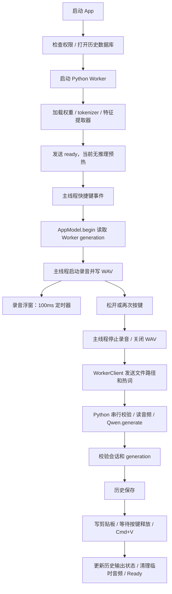

# 8GB Mac 闲置后首次输入稳定性优化方案

日期：2026-09-12。状态：代码审查与实施计划，尚未实施性能改动。

适用设备：用户当前的 MacBook Neo / A18 Pro / 8GB 统一内存，macOS 26.4。

目标：保持现有交互、识别能力和功能，使启动后、闲置后、切换到其他应用再回来时的第一次语音输入更稳定，同时减少对其他应用的影响。

## 1. 建议与实施顺序

优先围绕三个用户能感知的时间优化：**按下后多久真正开始录音、松开后多久发出粘贴、闲置后的第一次比连续使用慢多少**。单纯降低活动监视器中的某个内存数字，不作为完成标准。

建议先补测量，随后修复明确的界面重复工作和录音调度问题，再验证启动预热、临时缓存预算。录音期间提前准备模型和少量内存保留作为实验项，只有实机对比有效才启用。

| 优先级 | 编号 | 优化项 | 主要收益 | 风险 / 工作量 | 推进条件 |
| --- | --- | --- | --- | --- | --- |
| P0 | O1 | 分阶段耗时、内存与闲置基线 | 确认第一次到底卡在哪，防止误优化 | 低 / 中 | 第一项实施 |
| P1 | O2 | 浮窗复用、只在显示内容变化时更新 | 减少主线程与窗口合成负担 | 低 / 小 | 可在 O1 后直接实施 |
| P1 | O3 | 录音控制离开主线程，保证按下/松开/取消顺序 | 降低首次录音和松开时卡顿，保护短输入 | 中高 / 大 | 必须带事件时序、音频完整性验证 |
| P1 | O4 | Worker 启停与恢复去重、退出确认 | 避免重复加载、重启重叠和恢复竞态 | 中 / 中 | 在增加任何预热请求前完成 |
| P1 | O5 | 启动时一次轻量推理预热 | 降低进程启动后的首轮额外耗时 | 中 / 中 | O1、O4；对比启动总耗时 |
| P1 | O6 | 8GB 设备的临时缓存预算 | 控制推理分配峰值和运行后保留内存 | 中 / 中 | O1；逐档 A/B 后选参数 |
| P2 | O7 | 闲置后，在实际录音开始时提前准备模型 | 将部分恢复工作移到用户说话期间 | 高 / 大 | O1、O3、O4、O5；短句不能退步 |
| P2 | O8 | 小额度模型内存保留实验 | 减少闲置期间模型内存被换出的机会 | 高 / 中 | 换页证据明确，且 O5/O6 不足时 |
| P2 | O9 | 复用音频缓冲、减少重复读音频、精简启动路径 | 改善次要开销与较长录音的分配波动 | 中 / 中 | 对应阶段测得有明显占比 |
| P2 | O10 | 优化构建与必要的事件/活动调度 | 降低 Swift 开销，进一步保护快捷键响应 | 构建低、调度迁移高 / 中 | Release 单独对比；调度调整需证据 |

P0 是决策前提；P1 是首批实施范围；P2 是有证据才推进的项目。编号用于跟踪，不代表所有项目都必须完成，也不代表收益已被测得。

第一批建议交付 O1～O6，每项独立验证和保留回退能力。O7、O8 默认关闭，不和第一批打包启用。

## 2. 功能与体验边界

本方案以当前工作区代码和用户最新要求为行为基线。工作区已有快捷键及粘贴相关改动，实施时应保留；审查时 HEAD 为 `9a57370`，它不是完整的当前工作区快照。正式基线需额外记录工作区补丁或内容摘要。

| 能力 | 优化必须保持的行为 |
| --- | --- |
| Hold / Toggle | 同样的触发方式、自定义快捷键、按键捕获与释放规则；不要求用户额外按一次或等待提示再说话 |
| 快速短输入 | “好”“收到”等短词照常可用；不能以最短时长门槛换取速度 |
| 较长输入 | 保持当前 120 秒录音上限、整段识别；不缩短录音，不改成分段或流式输出 |
| 取消和忙碌状态 | 保留 Esc、拒绝重叠会话、晚到结果隔离；优化不能让取消内容进入历史或输出 |
| 识别结果 | 保留当前 Qwen 0.6B 4bit、自动语言检测、标点和文字处理方式；不减少正式识别 token 预算 |
| 热词 | 保留开关、增删改、完整词表和预算检查；不通过裁剪热词提速 |
| 输出 | 保留历史保存、剪贴板、单次 Cmd+V、按键释放及剪贴板竞争保护；不改变现有粘贴目标规则 |
| 历史与设置 | 保存全部现有历史，保持查询、分页、复制、删除、设置及权限流程 |
| 麦克风与后台 | 仅明确开始录音时采集，停止/取消后结束采集；不通过后台持续录音来预热 |
| 跨应用体验 | 不抢焦点，不改变浮窗外观和提示开关，不以拖慢浏览器、Office 等应用换取本应用速度 |

特别说明：较早的 PRD / 兼容性矩阵描述过“切换窗口则跳过粘贴”；当前实际输出代码已采用发送时的系统焦点，没有执行那套焦点检查。本性能计划保持当前实现，不借优化恢复旧规则。[当前输出入口](/Users/tw/proj/语音输入法/apps/macos/Sources/VoiceInputApp/AppModel.swift:161)、[当前输出策略](/Users/tw/proj/语音输入法/apps/macos/Sources/VoiceInputCore/OutputService.swift:21)。

## 3. 当前设备和实测证据

### 3.1 环境

| 项目 | 已检查结果 |
| --- | --- |
| 设备内存 / 型号标识 | 8,589,934,592 bytes；Mac17,5 |
| 产品评测设备 | 项目报告记录 A18 Pro、8GB、macOS 26.4，与本机环境一致 |
| Python | 项目 runtime 清单为 Python 3.11.15，使用 uv 管理 |
| 当前已安装依赖 | MLX 0.32.2、mlx-audio 0.5.3、NumPy 2.4.6、Transformers 5.17.0 |
| 模型 | 项目内 Qwen3-ASR-0.6B-4bit，现有权重与量化配置保持不变 |
| 开发构建 | 构建脚本明确使用 Swift `-c debug` |
| 分析工具 | 当前选择 Command Line Tools；`xcrun --find xctrace` 不可用，不能假定已具备完整 Instruments |

依赖锁摘要与 [runtime 清单](/Users/tw/proj/语音输入法/config/runtime-resources.json) 一致。性能实验固定这组版本，避免把依赖升级与性能调参混在一起。

### 3.2 已观察到的现象

1. 用户反馈：应用闲置后、使用其他应用一段时间后、进程启动后的首次使用更容易卡；连续使用通常恢复流畅。
2. 上一轮排查快照（2026-09-11 晚间）：系统交换空间已用约 5.6GB。Worker 的 `vmmap` physical footprint 约 825.7MiB，进程峰值约 1.4GiB。它们是当时的快照，不代表当前每次使用的占用。
3. 本轮只读统计了 67 条历史记录的时长字段。对不超过 5 秒的录音，用相邻记录时间减去本条录音与推理时长近似估计闲置间隔：

| 粗略分组 | 样本数 | 推理中位数 | 最长推理 |
| --- | ---: | ---: | ---: |
| 前次使用后约 60 秒以内 | 24 | 476ms | 1,170ms |
| 前次使用后约 60 秒以上 | 14 | 575.5ms | 4,536ms |

这不是受控测试：文本、录音长度、系统负载和 Worker 是否重启均可能不同；相邻历史时间也不是精确的最后使用时间。它说明存在明显的慢样本，不能据此认定“闲置一定慢”或计算可靠的 P95。

项目 [ASR 评测报告](/Users/tw/proj/语音输入法/results/ASR_Benchmark报告.md:1) 中，Qwen 的 Metal 峰值约 1,415MiB，10 条样本推理中位数约 1.75 秒，基础 MER 为 2.64%。那组录音长度与日常短输入不同，不能直接用它衡量闲置恢复速度。

### 3.3 原因判断的可信度

| 判断 | 当前证据强度 | 还需验证什么 |
| --- | --- | --- |
| 闲置后部分模型/运行时内存被压缩或换出，首次恢复需要时间 | 与用户现象、系统快照一致的主要假设 | 同一次慢输入的换页增量、内存压力和 Worker 阶段耗时 |
| 首次推理包含模型加载之外的初始化 | 代码确认没有推理预热；实际额外耗时待测 | import、音频解码、特征提取、Metal 首次运算分别占多少 |
| 主线程阻塞会放大快捷键、录音和浮窗延迟 | 代码确认共用主线程 | 卡顿时主线程栈和各同步调用耗时 |
| 浮窗有多余视图创建 | 代码直接确认 | 对主线程、WindowServer 和耗电的实际改善幅度 |
| 后台调度、节能或热状态造成额外延迟 | 次要假设，尚无本机会话证据 | 区分 App Nap、主线程排队、CPU/GPU 忙碌与实际换页 |
| 长时间运行存在资源泄漏 | 目前不能确定 | 多轮相同输入后，在相同闲置点测内存趋势 |

macOS 内存压力需要结合可用内存、换页速率、固定内存等指标判断，不能只看 Swap 总量。[Apple 内存说明](https://support.apple.com/en-gb/guide/activity-monitor/actmntr1004/mac)。MLX 内存、RSS 和 physical footprint 的范围不同，不能直接相加；尤其不能把较小的 Python RSS 当作模型全部占用。

## 4. 实际代码链路

| 阶段 | 代码位置 | 重要实现与影响 |
| --- | --- | --- |
| 启动 | [AppModel.launch](/Users/tw/proj/语音输入法/apps/macos/Sources/VoiceInputApp/AppModel.swift:53) | 数据库初始化在主线程；等待 Worker 后才 Ready；历史与热词随后读取 |
| 全局快捷键 | [ShortcutService.start](/Users/tw/proj/语音输入法/apps/macos/Sources/VoiceInputApp/ShortcutService.swift:52) | 事件 tap 安装到主 RunLoop；主线程阻塞会延后快捷键处理 |
| 开始录音 | [AppModel.begin](/Users/tw/proj/语音输入法/apps/macos/Sources/VoiceInputApp/AppModel.swift:104) | 内层 Task 仍继承 MainActor；读 generation 的 await 在会话建立之前 |
| 音频控制 | [AudioCapture](/Users/tw/proj/语音输入法/apps/macos/Sources/VoiceInputApp/AudioCapture.swift:11) | start/stop 同步；音频回调与启停共用 NSLock；回调内转换、分配输出缓冲并写文件 |
| 录音提示 | [录音计时器](/Users/tw/proj/语音输入法/apps/macos/Sources/VoiceInputApp/AppModel.swift:120)、[HUD.show](/Users/tw/proj/语音输入法/apps/macos/Sources/VoiceInputApp/HUDController.swift:17) | 每秒调用 10 次，显示只精确到秒，却每次创建 NSHostingView、定位并置前窗口 |
| 提交 | [AppModel.end](/Users/tw/proj/语音输入法/apps/macos/Sources/VoiceInputApp/AppModel.swift:138) | 同步停止音频后才更新状态并提交识别；麦克风停止时间位于用户等待路径 |
| 进程通信 | [WorkerClient](/Users/tw/proj/语音输入法/apps/macos/Sources/VoiceInputCore/WorkerClient.swift:65) | 独立 actor；ready 轮询只在启动时发生，不是常驻的空闲轮询 |
| 推理 | [worker.serve](/Users/tw/proj/语音输入法/voice_input/worker.py:58)、[QwenMLXAdapter](/Users/tw/proj/语音输入法/voice_input/adapter.py:30) | 一个进程串行识别；模型仅构造时加载；没有按闲置时长卸载模型的逻辑 |
| 存储 | [HistoryRepository](/Users/tw/proj/语音输入法/apps/macos/Sources/VoiceInputCore/HistoryRepository.swift:8) | 查询和写入由 actor 执行；已有 WAL、时间索引与默认 50 条分页，不是每次载入全部历史 |
| 输出 | [OutputService.deliver](/Users/tw/proj/语音输入法/apps/macos/Sources/VoiceInputCore/OutputService.swift:132) | 等待用异步 sleep；现有 60ms 剪贴板准备、20ms 键事件间隔、500ms 按键释放超时各有用途 |
| 异常恢复 | [取消/恢复入口](/Users/tw/proj/语音输入法/apps/macos/Sources/VoiceInputApp/AppModel.swift:190)、[Worker.stop](/Users/tw/proj/语音输入法/apps/macos/Sources/VoiceInputCore/WorkerClient.swift:122) | 识别取消会重启 Worker；旧进程 terminate 后未显式等待退出确认 |

**不能从函数名误判瓶颈：** `focusTimer` 当前只更新录音计时，不做焦点扫描；底层 Qwen 已在编码、embedding 和片段结束等位置调用 `mx.clear_cache()`；当前 WAV 读取走 miniaudio，不能按“每次识别都拉起 ffmpeg”来制定方案。

## 5. 各优化项的具体设计

### O1 · P0：先建立可复现的测量链路

当前 `inference_ms` 只覆盖适配器转写；历史里的 `end_to_end_ms` 从会话开始算到构造历史记录，包含录音时间，却尚未包含历史写入和粘贴阶段。因此它不能用作“松开到文字出现”。[现有统计位置](/Users/tw/proj/语音输入法/apps/macos/Sources/VoiceInputApp/AppModel.swift:149)。

先增加不改变产品界面的本地性能记录，使用 session ID、Worker generation 和进程启动 ID 关联。关键测量点如下：

| 指标 | 起止点 | 用途 |
| --- | --- | --- |
| `launch_to_ready_ms` | App 启动 → Ready | 防止把首轮等待全部藏到更慢的启动里 |
| `worker_load_ms` / `warmup_ms` | Worker 内分别测加载、预热 | 分清权重读取与首次推理初始化 |
| `event_dispatch_ms` | 系统按键事件 → 回调/主线程处理 | 区分快捷键事件晚到与录音启动慢 |
| `start_to_first_audio_ms` | 合法开始请求 → 第一块有效音频回调 | 衡量真正开始采集，而不是浮窗先亮起来 |
| `stop_to_audio_closed_ms` | 合法停止请求 → 尾部音频写入、文件可读 | 定位音频锁、设备停止、磁盘等待 |
| `worker_roundtrip_ms` | Swift 写请求 → 收到结果 | 包括 IPC、排队、校验和推理 |
| `asr_ms` | Python 适配器开始 → 返回文本 | 延续现有推理口径 |
| `history_write_ms` | 历史写入开始 → 完成 | 判断是否有存储慢点 |
| `stop_to_clipboard_ms` | 停止请求 → 剪贴板写入完成 | 对手动粘贴也有意义 |
| `stop_to_paste_attempt_ms` | 停止请求 → Cmd+V 按下事件发出 | 产品可可靠记录的自动输出延迟 |
| `stop_to_ready_ms` | 停止请求 → 会话释放为 Ready | 判断是否影响紧接着的下一次输入 |

Swift 内采用统一的单调时钟；系统事件时间需明确转换到同一时间基准。Python 内用 `perf_counter` 记录本地 duration。不能直接相减两个进程不经校准的绝对时间戳。睡眠恢复单独标记，不与普通闲置混算。

如 `asr_ms` 明显主导，第二步再在独立诊断脚本中细分音频读取、特征提取、encoder、prefill、decode。先用固定版本的分析入口，不为了测量把第三方库的大段实现复制进产品，也不在正式路径每个算子后强制同步。

内存记录包括：MLX active/cache/peak、Worker 和主程序 physical footprint、系统 memory pressure、采样期间 swap-in/out 增量。每次推理独立 reset peak；区分空闲、预热后、推理峰值、恢复空闲四个时间点。进程 footprint 与 MLX 指标分别报告。

诊断还要记录准确的最后活动时间、Worker 是否为新进程、预热是否执行、录音长度、热词数量、构建模式与实验参数。测试标注插电/电池、低电量模式和系统 thermalState，避免把电源与温度差异误归因于代码。只记录这些性能元数据，不记录正文、热词内容或录音。诊断文件可设总量 5MiB 的轮转上限，和永久保留的转写历史分开。

测试时开启较细采样；日常仅保留事件边界的轻量记录和系统内存压力通知，空闲不启动高频采样。诊断自身耗时也要 A/B 检查。

**完成标准：** 一条慢输入能够被定位到事件、录音、Worker、存储或输出某一段；`paste_attempt` 明确不等于外部应用已经显示文字，真实显示需在受控输入框中另行测量。

测量后的选择规则：

| 慢点落在哪里 | 下一步优先做什么 |
| --- | --- |
| 事件晚到，或按下后很久才有首块音频 | O2/O3；仍有调度问题时再选 O10 |
| 新 Worker 首次 ASR 很慢，第二次明显正常 | O5，进一步拆开导入/特征提取/首次 Metal 运算 |
| 闲置首次 ASR 很慢，同时有明显换页增量 | O6；不足时分别实验 O7/O8 |
| IPC 往返远大于 ASR 耗时，或恢复时存在多进程 | O4，检查任务排队、reader 和生命周期 |
| ASR 已很快，但历史写入或输出阶段很慢 | 定位对应 I/O 或目标应用；保留输出保护，不继续盲调模型 |
| 闲置前后差别不大，长句解码占主要时间 | 作为单独性能问题记录；本轮先保护完整转写能力 |

### O2 · P1：复用录音浮窗

改动范围：HUDController，以及 AppModel 中调用录音计时更新的部分。

实现方向：只创建一次 NSHostingView，使用可观察状态更新文本和图标；内容相同时直接返回。计时更新对齐秒变化，窗口定位只在首次显示、屏幕变化或确有需要时进行。保持原有浮窗样式、位置规则、非激活属性和提示时长。

计时调度仍需保证与原来接近的秒切换时刻，避免简单改成带大容差的 1 秒定时器后产生可见延迟。完成会话时取消计时，非持久提示继续使用原来的 2 秒规则。

**预期：** 降低录音期间 UI 分配和合成工作；这项不能单独解决模型换入造成的秒级延迟。

**验证：** 同样的 60/120 秒录音，HUD 视图实例不随时间增长；文字、图标、结束隐藏、关闭结果提示、全屏/多屏行为一致。这里以分配观察和 UI 验收为主，不写只检查实现细节的测试。

### O3 · P1：分离录音控制，并保证事件顺序

两个需要一起处理的问题：

1. `audio.start()` / `audio.stop()` 在 MainActor 上同步执行，且控制路径与音频回调共用锁。设备启动、转换或写文件的等待可能让界面和全局快捷键一起停顿。stop 持锁调用 removeTap/engine.stop 的方式还存在锁等待风险，需要采样确认，不能直接认定已发生死锁。
2. `begin()` 在创建会话之前先 await Worker generation；如果这时发生松开事件，`end()` 可能看到尚无录音会话而返回。这是代码上可推导的时序风险，在内存压力和调度延迟下值得优先测试，尚未实机复现。

实施分两步：

- 将 AVAudioEngine 的创建/启停/设备重配收敛到同一个专用串行执行队列。UI 状态、窗口和输出仍留在 MainActor；仅包装一个继承 MainActor 的 `Task` 不算移出了主线程。
- 在进入异步启动前建立内部操作标识，按顺序记录 start/stop/cancel 意图。快速松开、Esc、设备变化都绑定到相同 session，不能丢掉停止意图，也不能让旧启动完成后重新打开已取消的麦克风。该内部协调不增加用户操作，也不新增录音排队功能。

音频锁只保护短暂状态访问；避免持有回调所需的锁进行 engine.stop 等可能等待回调的操作。停止需要完成“关闭本次输入 → 确认在途回调结束 → 写完尾部数据 → 释放文件 → 提交 Worker”的明确顺序，不能通过提前返回 stop 缩短统计值却丢失结尾语音。

首批保留原有 16kHz 单声道 PCM 和整段 WAV 协议。回调内部的文件写入是否再搬移，取决于 O1 证据；若后续搬移，必须用有界缓冲和背压/错误处理，不能每个回调无界投递任务，也不能静默丢帧。

**验证：** 快速按下后立即松开、启动尚未完成时 Esc、连续 Hold、Toggle、修饰键先松开、触发键先松开、设备切换和睡眠；检查音频起始/结尾、会话数、文件生命周期以及 Ready 状态。所有异步完成都校验 session 标识。

### O4 · P1：约束 Worker 生命周期

当前 `stop()` 发出 terminate 后立即丢弃 Process 引用，`start()` 随后可以创建新进程。旧进程未及时退出时，有短暂保留两份模型的可能。多个异步启动/取消/重试入口也需要统一协调。这些是结构风险，当前没有证据表明日常闲置时一直存在双 Worker。

实施方向：

- 同一配置同一时刻只允许一个启动过程；重复启动请求共享结果。重试、退出、识别取消和超时统一进入生命周期管理。
- 在后台异步等待旧进程退出确认，才开始新的模型加载；超时只处置本应用持有的旧子进程，不扫描或终止其他 Python 进程。
- 每个启动任务保留自己的 generation/进程身份。旧启动的超时、EOF 或异常不能停止新进程；中止后的 ready 消息不能把已停止的 Worker 标成可用。
- 停止时清理读取任务、stderr handler、管道句柄、超时任务和 continuation；退出后不留下重试任务。
- 保留当前 120 秒识别看门狗和有界重试语义，明确区分正常闲置、取消重建和故障恢复，不因“闲置时间长”自动重启。

**验证：** 用可控 mock Worker 覆盖慢启动、忽略退出信号、退出与启动重叠、旧 ready/result 晚到、启动途中退出 App；确认最多一个活跃模型实例，且每个请求恰好结束一次。再以真实 Worker 做取消后恢复的内存峰值检查。

### O5 · P1：启动后只做一次轻量推理预热

当前 `load_model(lazy=False)` 已求值模型参数，但没有跑一遍实际转写。只重复 `mx.eval(model.parameters())` 不能保证音频解码、特征提取、encoder 和首次 decode 已准备好；已求值数组也不一定因此完整重新触达。

建议新增仅供内部调用的 `warmup()`：使用固定的本地合成测试音频或固定测试 fixture，走与实际输入一致的预处理、编码和极少量生成步骤，例如 1～4 个 token。预热参数独立于正式识别参数，不修改用户转写预算。预热不使用麦克风、不产生历史、不触碰剪贴板。

需避免把全零 WAV 送到当前 `transcribe()` 后被 `audio_has_signal()` 直接短路；也要避免仅传数组预热却漏掉第一次 WAV 解码的初始化。测试应确认实际走过需要预热的路径，并在发送 ready 前完成必要求值。

预热计入既有启动期限，只使用已有“启动中”状态。记录它给启动增加的时间以及首轮减少的时间；对非致命预热失败，保留标准识别路径、记录状态，避免单纯为预热不断重载模型。Worker 已退出或模型不可用时按现有启动失败恢复。

**验证：** 同样配置比较未预热与预热的 `launch_to_ready`、第一次短句、第二次短句、内存峰值；样本不只一种语言。预热结束后不能残留用户可见输出或额外后台周期任务。

**限制：** 该方案改善新进程首轮初始化，不能保证经过十几分钟内存压力后模型仍然留在物理内存。

### O6 · P1：控制临时缓存，保持常驻模型

区分三种 MLX 控制项：

| API | 真正控制什么 | 本计划的使用方式 |
| --- | --- | --- |
| `set_cache_limit` | 已释放但为复用而缓存的缓冲区 | 首选实验项；不把缓存上限当作整个进程内存上限 |
| `set_memory_limit` | 图计算分配的内存指导值 | 暂不简单设置成低于现有峰值的“硬限额”，不能保证据此不发生 Swap |
| `set_wired_limit` | 保持驻留的内存额度 | 放入 O8，独立测试其对系统其他应用的代价 |

上述语义来自固定版本本地接口及 [MLX 缓存文档](https://ml-explore.github.io/mlx/build/html/python/_autosummary/mlx.core.set_cache_limit.html)、[内存指导值文档](https://ml-explore.github.io/mlx/build/html/python/_autosummary/mlx.core.set_memory_limit.html)。

实验先比较“当前默认、256MiB、128MiB”三个 cache 档位，其他条件一致。参数是起始搜索范围，不是已经验证的最佳配置。缓存变小可能减少保留内存，也可能增加重复分配和推理时间，依据整体体验选档。

底层已经多次 clear_cache，先测剩余缓存和峰值构成。如果主要占用是活跃模型权重/中间张量，额外清缓存的收益可能很小。不得直接删除第三方库已有清理调用来提高热态速度，也不在每次用户输入后无条件做重型垃圾回收。

内存压力通知只更新轻量标记；在 Worker 的安全调度点执行必要缓存释放，避免 Swift/其他线程与 MLX 推理并发修改全局内存策略。内存压力高时暂停可选预热，不卸载当前会话所需模型。

**验证：** 同一音频的冷/热耗时、单次峰值、会话后 footprint、120 秒录音、最大合法热词集、他应用打字/滚动。选择能减少内存或波动且没有热态/长句退步的档位；没有收益则保留默认。

### O7 · P2：录音期间提前准备模型，必须允许真实任务优先

现有 Python Worker 是“读一行 → 完整执行 → 再读下一行”。如果直接增加同步 `prepare` 消息，真实短句请求可能排在预热后，反而变慢。所以这项需要小型内部调度设计，不是多发一条消息即可。

候选流程：实际录音开始后，若 Worker 已闲置超过候选阈值（先试 60 秒，再视结果比较 30/120 秒），异步请求一次准备。正常跨应用切换本身不触发模型运算，连续输入不重复准备。

调度要求：

- 输入接收可独立读取控制消息，模型运算始终只有一个执行者；所有 MLX 操作保持同一受控执行上下文，避免线程本地 stream 误用。
- 最多一个准备任务；相同会话重复请求合并。真实 `transcribe` 到达时，取消尚未开始的准备；正在执行的准备只做有界工作，在可安全停止的阶段让出。
- 不能把“Swift 等待超时”当作 Python/Metal 运算已停止。单次 encoder 在高内存压力下也可能耗时较长；如果无法证明短输入不退步，这个方案维持关闭。
- 协议使用独立的准备确认，不能返回可被当成识别结果的帧。通过 ready capabilities 协商；不支持的 Worker 继续原路径。
- Esc、设备变化、会话失效或 Worker generation 改变后，准备结果不改变 UI、不输出文字、不让旧会话恢复。

启动预热复用的资源必须有明确生命周期；预热使用的缓存不能无界累积。内存压力高时允许跳过准备，用户仍按原流程完成识别。

**启用条件：** 0.3～1 秒短词、1～5 秒短句和较长录音都完成对比；闲置后尾部延迟改善，真实任务排队不增加。收益不足以覆盖调度复杂度时停止推进。

### O8 · P2：有限驻留内存实验

若受控采样证实首次延迟主要来自模型内存换入，可试探小额度 wired limit。MLX 0.32.2 文档说明该额度默认为 0，macOS 15+ 可用；它是驻留额度，不是整进程内存预算，也不保证精确锁定所选模型层。[MLX 驻留文档](https://ml-explore.github.io/mlx/build/html/python/_autosummary/mlx.core.set_wired_limit.html)。

本地 Qwen 路径直接调用 `generate_step`；不能因旁边存在通用 LM 的 `wired_limit` 包装就假定该包装已经保护了当前 ASR 路径。实验前记录实际生效值和调用路径。

候选只从 0、256、512MiB 比较；若必要再小幅扩大，始终受设备报告的系统上限约束。保留策略必须在闲置期实际生效才可能改善下次换入，单纯在转写时短暂提高额度不能解决闲置问题。

这会减少系统可回收的内存，在 8GB 上可能把卡顿转移到浏览器或 Office。必须同时观察系统压力、其他应用响应和电量；出现更严重压缩/换页或他应用退步就回退为 0。内存压力事件可在安全点降低驻留额度，不在推理中跨线程修改。

本计划不修改系统 `sysctl`、不要求管理员扩大 GPU 驻留上限，也不默认锁住全部可用统一内存。

### O9 · P2：只处理测得有收益的次要开销

| 候选项 | 当前情况 | 推进方式 |
| --- | --- | --- |
| 音频缓冲复用 | 每块输入创建新的输出 PCM buffer | 根据输入格式维护可复用容量，格式变化重建；验证帧数和转换输出 |
| 减少重复读 WAV | 适配器先整段读文件判数字静音，模型随后再读 | 先将静音检查改为分块、遇非零退出，保持原有保守语义；若合并解码再验证浮点归一化完全一致 |
| 启动路径整理 | 数据库初始化、旧 WAV 清理在主线程；热词在 Ready 后读取 | 把独立工作移到合适队列，记录依赖；确保首个正式请求使用完整的已保存热词 |
| 历史与设置刷新 | 已有 actor 和分页，非全量扫描式加载 | 测得写入/渲染慢时再优化准备语句或视图更新，不改变持久化顺序和查询行为 |
| Python import | 有延迟导入，未证实存在无关重型依赖开销 | 用独立冷启动 import profile 验证后精简；不笼统禁用某个框架或任意设置线程数 |

16kHz、16bit、单声道、120 秒 PCM 正文约为 3.84MB，音频文件本身远小于模型占用。因此“把 WAV 改成共享内存”不是首批优化，不能期望靠它解决约 GB 级内存问题。

### O10 · P2：构建、快捷键线程与活动调度

为日常版本增加可选 Release 构建，保留现有 Bundle ID、签名 designated requirement、权限、资源路径和开发 debug 入口。先在独立输出位置验证，不覆盖正在运行的应用；不同时运行两份加载模型的版本。Release 只优化 Swift 部分，不会自动提高 Python/MLX 推理速度。[当前构建脚本](/Users/tw/proj/语音输入法/scripts/build-macos-app.sh:14)。

若 O2/O3 后 `event_dispatch_ms` 仍有明显慢点，再把 event tap 放到专用 RunLoop 线程。需要同步快捷键配置快照、停止顺序、tap 恢复与事件消费状态，确保合成粘贴事件依然放行；所有 UI 调用仍回主线程。仅加线程不能修复 MainActor 中真正的录音启动延迟，因此不先做这项迁移。

若测得真实输入期间存在后台调度限制，再评估仅覆盖当前用户会话的 activity 声明，完成、取消和失败时都结束。必须分别验证 Swift 主程序与 Python Worker 的实际效果，不能假定父进程的声明自动改善子进程。空闲时恢复正常节能；不全局禁用 App Nap，不默认使用最高精度的 latencyCritical，也不以禁止系统睡眠来维持热态。[Apple 活动管理说明](https://developer.apple.com/documentation/foundation/processinfo)。

## 6. 暂不采用的路径及原因

| 路径 | 与本次目标的冲突 |
| --- | --- |
| 按固定闲置时间卸载模型 / 定时重启 Worker | 会让用户回来后重新支付加载成本，直接影响第一次使用 |
| 每几秒跑一次假识别保持热态 | 增加常驻 CPU/GPU 活动和耗电，且可能影响其他应用 |
| 后台持续打开麦克风 | 改变现有采集边界和用户体验 |
| 更换更小模型、再次量化、固定中文、截断热词或输出 | 可能降低识别能力，超出本次保持功能的要求 |
| 缩短录音上限、强制分段或流式输入 | 改变长输入行为和识别上下文 |
| 删除粘贴准备时间、按键释放等待、历史先保存步骤 | 改变现有输出可靠性；约 80ms 的固有等待也解释不了 4.5 秒推理慢样本 |
| 禁用 Swap / 定期清系统内存 / 要求用户先关闭办公应用 | 改变系统使用方式，无法作为这款产品的默认优化 |
| 一次性升级依赖并改全部性能参数 | 无法归因收益，也难以定位识别或稳定性回归 |

## 7. 验证方法与验收建议

### 7.1 两层测试

第一层是独立 Worker 的固定音频测试，定位模型加载、闲置恢复、缓存和准确率；同一时间只运行一份模型，不让测试进程与日常 App 争抢内存后得出错误结论。

第二层是完整 App 的实际快捷键、录音、历史与粘贴测试，覆盖主线程、麦克风和外部应用接收。这两层结果分别报告；Worker benchmark 通过不等于用户体验通过。

现有 10 条评测音频用于准确率和原有模型表现回归；额外准备固定的极短词、短句及接近 120 秒录音。新增 fixture 不取自用户未授权保留的日常录音。

### 7.2 核心场景矩阵

| 场景 | 做法 | 首要观察 |
| --- | --- | --- |
| 新进程首次输入 | 重启应用，Ready 后输入固定短句，再连续输入同句 | 启动总耗时、第一次与第二次差值 |
| 闲置 1 / 5 / 15 / 30 分钟 | 不调用模型保活，按时回到同类输入位置使用 | 第一次延迟及后续三次恢复曲线 |
| 切到其他应用再使用 | 保持浏览器、办公和日常应用的真实组合，切换后输入 | 模型恢复、快捷键响应、其他应用卡顿 |
| 连续输入 | 同一长度/语言的短句重复使用 | 热态延迟不能退步 |
| 极短输入 | 立即松开、短词、低声；含准备任务尚未完成时停止 | 不漏开始/结束事件、不丢首尾、不被预热排队 |
| 长输入 | 30 / 60 / 接近 120 秒，含中英混输与完整热词 | 峰值内存、转写完整性、超时及取消 |
| 睡眠 / 唤醒 / 默认麦克风改变 | 使用系统正常操作 | 音频重建与 Worker 恢复正确，没有旧会话复活 |
| 连续运行 | 1～2 小时混合操作，并在固定空闲点采样 | footprint 趋势、句柄/任务增长、首次延迟恶化 |

工作负载分三档：系统较轻；用户日常应用组合；自然出现明显内存压力的组合。常用组合为主要验收对象。使用原有应用进行打字、滚动和切换，记录有无新增卡顿；不通过无上限占满 8GB 的压力程序作为默认测试。

先每个核心场景做 5 组配对筛查，保留基线 A 与候选 B，跨时段交错顺序，避免 B 总是得到已经预热的系统缓存。筛查有效后，优先积累至少 30 次“日常负载 + 闲置后第一次”的样本；不同闲置长度、语言和录音长度分别标注，不能混为一组。

30 分钟闲置、睡眠等昂贵场景先少量验证，再随真实使用累积。小样本报告原始数值、中位数、最大值和超过 2 秒/3 秒的次数；P95 只在样本足够时作为方向参考，不用少数样本宣称稳定的统计结论。

### 7.3 建议目标，而非已验证承诺

以下是本机实施后的工程候选目标，先由 O1 确认基线和合理性，不改变原 PRD 对延迟标准的约定。

| 维度 | 候选目标 / 决策规则 |
| --- | --- |
| 闲置后首轮 | 日常负载、固定 1～5 秒语音，`stop_to_paste_attempt` P95 相对基线下降约 30%；如基线已很低，以异常慢样本次数和分段稳定性为准 |
| 首轮额外代价 | 同一音频闲置首次与紧接的热态差值尽量控制在 500ms 内；在高压力场景单列，不承诺任意负载都达标 |
| 连续使用 | 配对测试 P50/P95 不出现可重复的明显退步；退步超过约 10% 或 100ms 中较大者时阻止该实验默认启用 |
| 快捷键与录音 | UI 事件处理力争 100ms 内；实际首个音频 buffer 单独测量，不能用提前显示浮窗代替采集改善 |
| 识别质量 | 固定回归集逐条比较文字，记录 MER 与热词召回；出现新增漏词、截断或语言退步即检查并回退相关改动 |
| 长输入 | 现有 120 秒输入与合法热词预算完整可用；保持取消和超时保护 |
| 内存 | 单次峰值不比同场景基线显著恶化；重复任务后的空闲 footprint 不持续增长；若采用 O8，单列驻留增加量 |
| 系统体验 | 正常空闲不运行周期性 GPU 推理；其他应用没有新增可重复卡顿；压力和换页增量不能因优化持续恶化 |
| 功能 | 下表各项无回归，不能用平均速度提升抵消功能损失 |

Apple 将约 100ms 以上的离散交互延迟视为开始可感知的响应问题，因此这里将它用作 UI 侧参考，不用它要求完整 ASR 必须在 100ms 内完成。[Apple 响应性指导](https://developer.apple.com/documentation/xcode/improving-app-responsiveness)。

### 7.4 必须保持的回归行为

| 类别 | 验证内容 |
| --- | --- |
| 快捷键 | 默认和自定义 Hold/Toggle、自动重复、按键释放顺序、tap 恢复、合成粘贴放行 |
| 会话 | 极短按住、连续输入、交叉模式忙碌、启动途中停止/取消、generation 切换、晚到结果 |
| 输出 | 历史与剪贴板正常；只粘贴一次；按键未松开、剪贴板同文重写/异文覆盖、发送中取消；不自动 Enter |
| 录音 | 不后台采集、空录音、数字静音、低声非零音频、首尾完整、120 秒上限、设备变化 |
| 数据 | 历史搜索/分页/复制/删除、热词增删改与开关、预算报错、设置持久化 |
| UI | 浮窗不抢焦点、菜单栏状态、结果提示开关、历史/设置窗口、全屏和多屏 |
| 恢复 | 进程崩溃、加载超时、取消识别、反复重试、退出应用后无遗留 Worker |

复用现有 Python 测试和 Swift 状态机/快捷键/输出测试；新测试重点补 O3 的异步时序、O4 的生命周期以及 O7 的任务优先级。视图复用、构建选项等低风险改动主要做有针对性的构建和人工检查，不扩张无价值测试。

本机可先用事件日志、轻量内存采样、系统 `sample` / `vmmap` 辅助定位。完整 XCTest 和 Instruments 需可用的完整 Xcode 环境；不把当前工具缺失记成已通过，也不因它阻塞所有可先做的测量。

## 8. 实施分批与交付物

| 批次 | 范围 | 本批交付 | 进入下一批的条件 |
| --- | --- | --- | --- |
| A | O1 | 性能采集入口、固定测试输入清单、现状分段报告、工作区/依赖基线 | 至少抓到新进程或闲置后慢输入的阶段归因 |
| B | O2 → O3 → O4，分别验证 | 浮窗复用、录音时序/线程调整、Worker 生命周期约束 | 原有交互与输出回归通过，无音频丢失或双 Worker |
| C | O5、O6 分别 A/B，再组合 | 启动预热结果、cache 参数对比、建议默认值 | 首次延迟改善，启动代价可解释，热态/长句/他应用无明显退步 |
| D | 按证据选 O7 或 O8，必要时 O9/O10 | 每个实验独立的开关、结果和保留/放弃决定 | 达到本机体验目标后停止增加复杂度 |
| E | 整体验证 | 闲置/切应用/长时间运行报告、已知限制、最终参数、回退说明 | 功能一致，主要场景稳定性收益可复现 |

O2 工作量较小；O3、O7 涉及并发时序，是主要工程成本。真实闲置与长时间使用验收需要实际等待，不能把几次连续调用替代成完成证明，因此此处不承诺未经基线确认的固定工期。

拟涉及文件：

| 文件或模块 | 计划用途 |
| --- | --- |
| [AppModel.swift](/Users/tw/proj/语音输入法/apps/macos/Sources/VoiceInputApp/AppModel.swift) | 时序协调、分阶段记录、HUD 更新、可选准备触发 |
| [AudioCapture.swift](/Users/tw/proj/语音输入法/apps/macos/Sources/VoiceInputApp/AudioCapture.swift) | 串行音频控制、回调结束和文件生命周期 |
| [HUDController.swift](/Users/tw/proj/语音输入法/apps/macos/Sources/VoiceInputApp/HUDController.swift) | 保持样式的视图复用 |
| [WorkerClient.swift](/Users/tw/proj/语音输入法/apps/macos/Sources/VoiceInputCore/WorkerClient.swift) | 生命周期、诊断字段、必要时的准备能力协商 |
| [worker.py](/Users/tw/proj/语音输入法/voice_input/worker.py) / [adapter.py](/Users/tw/proj/语音输入法/voice_input/adapter.py) | 预热、MLX 内存指标/策略、可选串行任务调度 |
| 拟新增本地性能脚本与结果目录 | 固定输入 A/B、元数据、图表或表格；与正式转写历史分离 |
| 现有 Swift/Python 测试 | 针对时序、取消、恢复和预热优先级的行为验证 |

每个策略参数集中配置，实验开关对开发测试可见，不默认增加用户设置项。O5/O6/O7/O8 可以独立停用；O3/O4 通过独立变更回退，不长期维持两套复杂生命周期实现。诊断首先采用可选字段或独立文件，避免为了性能重写历史数据库结构。

本轮仅新增此计划。没有修改应用源码、模型、依赖、系统内存设置或正在运行的应用，也没有把规划中的测试描述为已经执行。
